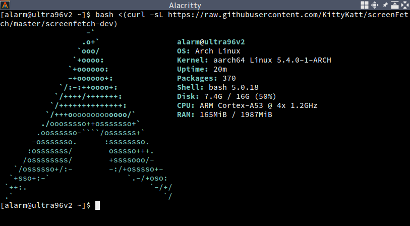

# zynqmp-arch

Arch Linux ARM for Xilinx Zynq UltraScale+ devices.



## Installation

**Required tools:**
- Linux-based host PC
- Vitis 2024.1 or later
- Statically-linked QEMU User space emulator for AArch64 + binfmt_misc configurations
    - If you are using Arch Linux, you can use [binfmt-qemu-static][binfmt-qemu-static] and [qemu-user-static][qemu-user-static] packages from the AUR ([ArchWiki][qemu-wiki]).
    - You can also use the [tonistiigi/binfmt][docker-binfmt] container image.
- [arch-install-scripts][arch-install-scripts]
    - We will use [`arch-chroot(8)`][arch-chroot-man] to chroot into the target system.

### Step1: Prepare the Hardware Design

Use Vivado to create the hardware design. After synth, impl, and generating bitstream, export the `.xsa` file by following the TCL command.

```
Vivado% write_hw_platform -fixed -include_bit system.xsa
```

### Step2: Build Boot Loaders and Firmwares

1. Generate First Stage Boot Loader (fsbl) and PMU Firmware (pmufw) sources:
    ```
    $ mkdir xsct && cd $_
    $ cp /path/to/system.xsa .

    $ xsct -nodisp -interactive <<'EOS'
    hsi open_hw_design system.xsa
    
    hsi create_sw_design fsbl -proc psu_cortexa53_0 -app zynqmp_fsbl
    hsi set_property CONFIG.stdin  psu_uart_1 [hsi get_os]
    hsi set_property CONFIG.stdout psu_uart_1 [hsi get_os]
    hsi generate_app -app zynqmp_fsbl -dir fsbl
    hsi close_sw_design [hsi current_sw_design]
    
    hsi create_sw_design pmufw -proc psu_pmu_0 -app zynqmp_pmufw
    hsi set_property CONFIG.stdin  psu_uart_1 [hsi get_os]
    hsi set_property CONFIG.stdout psu_uart_1 [hsi get_os]
    hsi generate_app -app zynqmp_pmufw -dir pmufw
    hsi close_sw_design [hsi current_sw_design]
    EOS

    $ cd ..
    ```
2. Buils fsbl:
    ```
    $ make -C xsct/fsbl
    ```
3. Build pmufw:
    ```
    $ make -C xsct/pmufw

    # or enabling Ultra96 customizations
    $ make -C xsct/pmufw CFLAGS="-DENABLE_MOD_ULTRA96 -DULTRA96_VERSION=2 -DPMU_MIO_INPUT_PIN_VAL=1 -DBOARD_SHUTDOWN_PIN_VAL=1 -DBOARD_SHUTDOWN_PIN_STATE_VAL=1"
    ```
4. Build [Xilinx/arm-trusted-firmware][atf-xilinx]:
    ```
    $ mkdir arm-trusted-firmware && cd $_
    $ curl -L https://github.com/Xilinx/arm-trusted-firmware/archive/xilinx-v2024.1.tar.gz | \
        tar xz --strip-components=1 -C .

    $ make CROSS_COMPILE=aarch64-linux-gnu- ARCH=aarch64 PLAT=zynqmp RESET_TO_BL31=1 ZYNQMP_CONSOLE=cadence1 -j16

    $ cd ..
    ```
5. Build [Xilinx/u-boot-xlnx][u-boot-xilinx]:
    ```
    $ mkdir u-boot-xlnx && cd $_
    $ curl -L https://github.com/Xilinx/u-boot-xlnx/archive/xilinx-v2024.1.tar.gz | \
        tar xz --strip-components=1 -C .

    $ make CROSS_COMPILE=aarch64-linux-gnu- ARCH=arm xilinx_zynqmp_virt_defconfig
    $ make CROSS_COMPILE=aarch64-linux-gnu- ARCH=arm \
        DEVICE_TREE="<your-target-device-tree-name>" \
        -j16 u-boot.elf

    $ cd ..
    ```
6. Create `BOOT.BIN`:
    ```
    $ mkdir boot && cd $_
    $ cp ../xsct/fsbl/executable.elf fsbl.elf
    $ cp ../xsct/pmufw/executable.elf pmufw.elf
    $ cp ../xsct/<bitstream_name>.bit bitstream.bit
    $ cp ../arm-trusted-firmware/build/zynqmp/release/bl31/bl31.elf .
    $ cp ../u-boot-xlnx/u-boot.elf .

    $ cat > boot.bif <<EOS
    all:
    {
      [destination_cpu=a53-0, bootloader]                       fsbl.elf
      [destination_cpu=pmu]                                     pmufw.elf
      [destination_device=pl]                                   bitstream.bit
      [destination_cpu=a53-0, exception_level=el-3, trustzone]  bl31.elf
      [destination_cpu=a53-0, exception_level=el-2]             u-boot.elf
    }
    EOS

    $ bootgen -arch zynqmp -image boot.bif -w -o BOOT.BIN

    $ cd ..
    ```

### Step3: Create Bootable SD Card

1. Partition the SD card:
    1. Start `fdisk`:
        ```
        $ sudo fdisk /dev/sdX
        ```
    2. Clear out all partitions:
        ```
        Command (m for help): o
        ```
    3. Create the first partition (32 MiB, FAT16, for `BOOT.BIN`):
        ```
        Command (m for help): n
        Partition type
        p   primary (0 primary, 0 extended, 4 free)
        e   extended (container for logical partitions)
        Select (default p): p
        Partition number (1-4, default 1): 1
        First sector (2048-15661055, default 2048):
        Last sector, +/-sectors or +/-size{K,M,G,T,P} (2048-15661055, default 15661055): +32M

        Created a new partition 1 of type 'Linux' and of size 32 MiB.
        
        Command (m for help): t
        Selected partition 1
        Hex code or alias (type L to list all): e
        Changed type of partition 'Linux' to 'W95 FAT16 (LBA)'.
        ```
    4. Create the second partition (remaining space, bootable, for Linux rootfs):
        ```
        Command (m for help): n
        Partition type
        p   primary (1 primary, 0 extended, 3 free)
        e   extended (container for logical partitions)
        Select (default p): p
        Partition number (2-4, default 2):
        First sector (67584-15661055, default 67584):
        Last sector, +/-sectors or +/-size{K,M,G,T,P} (67584-15661055, default 15661055):

        Created a new partition 2 of type 'Linux' and of size 7.4 GiB.

        Command (m for help): a
        Partition number (1,2, default 2):
        
        The bootable flag on partition 2 is enabled now.
        ```
    5. Write the partition table and exit:
        ```
        Command (m for help): w
        The partition table has been altered.
        Calling ioctl() to re-read partition table.
        Syncing disks.
        ```
2. Format partitions:
    ```
    $ sudo mkfs.vfat -F 16 /dev/sdX1
    $ sudo mkfs.ext4 /dev/sdX2
    ```
3. Download the latest Arch Linux ARM tarball and extract to the second partiton:
    ```
    $ curl -LO http://os.archlinuxarm.org/os/ArchLinuxARM-aarch64-latest.tar.gz
    $ curl -LO http://os.archlinuxarm.org/os/ArchLinuxARM-aarch64-latest.tar.gz.md5
    $ md5sum -c ArchLinuxARM-aarch64-latest.tar.gz.md5

    $ sudo mount /dev/sdX2 /mnt
    $ sudo bsdtar -xpf ArchLinuxARM-aarch64-latest.tar.gz -C /mnt
    $ sync
    ```
4. Chroot into the target system:
    ```
    $ sudo arch-chroot /mnt /bin/bash

    (chroot)# uname -m
    aarch64
    ```
5. Initialize the pacman keyring:
    ```
    (chroot)# pacman-key --init
    (chroot)# pacman-key --populate archlinuxarm
    ```
6. Add `zynqmp-arch` package repository:
    ```
    (chroot)# cat >> /etc/pacman.conf <<EOS
    
    [zynqmp-arch]
    SigLevel = Never
    Server = https://zynqmp-arch.myon.info/\$arch
    EOS
    ```
7. Add/Remove/Update packages:
    - Remove unneeded utilities:
        ```
        (chroot)# pacman -Rncs netctl dhcpcd net-tools
        ```
    - Remove pre-installed kernel:
        ```
        (chroot)# pacman -Rnd linux-aarch64
        ```
    - Update the system:
        ```
        (chroot)# pacman -Syu
        ```
    - Install the kernel ([linux-zynqmp](PKGBUILDs/linux-zynqmp/PKGBUILD)):
        ```
        (chroot)# pacman -S linux-zynqmp
        ```
    - Install Ultra96-V2 Wifi/BT driver ([wilc3000-ultra96v2](PKGBUILDs/wilc3000-ultra96v2/PKGBUILD)) and firmware ([wilc-firmware](PKGBUILDs/wilc-firmware/PKGBUILD)):
        ```
        (chroot)# pacman -S wilc3000-ultra96v2 wilc-firmware
        ```
    - Install [wpa_supplicant][wifi-wiki] for connecting Wifi:
        ```
        (chroot)# pacman -S wireless_tools wpa_supplicant
        ```
    - Remove unrequired packages:
        ```
        (chroot)# pacman -Rncs $(pacman -Qdtq)
        ```
8. Set passwords:
    ```
    (chroot)# passwd
    (chroot)# passwd alarm
    ```
9. Configure `/etc/fstab` and exit the chroot environment:
    ```
    (chroot)# cat >> /etc/fstab <<EOS
    /dev/mmcblk0p2 /     ext4 defaults 0 1
    EOS

    (chroot)# exit
    ```
10. Copy `boot.scr` to `/boot`:
    ```
    $ vim /path/to/zynqmp-arch/boot/boot.cmd    # modify if needed
    $ /path/to/u-boot-xlnx/tools/mkimage -c none -A arm64 -T script -d /path/to/zynqmp-arch/boot/boot.cmd boot.scr
    $ sudo mv boot.scr /mnt/boot/
    $ sudo umount /mnt
    ```
11. Copy `BOOT.BIN` (created in step2) to the first partition:
    ```
    $ sudo mount /dev/sdX2 /mnt
    $ sudo cp BOOT.BIN /mnt
    $ sudo umount /mnt
    ```

### Step4: Boot!

Insert the SD card and turn on the power. You will see the following messages via serial console.


    Zynq MP First Stage Boot Loader
    Release 2024.1   Jul 20 2024  -  08:13:47
    PMU Firmware 2024.1	Jul 20 2024   08:15:28
    PMU_ROM Version: xpbr-v8.1.0-0
    NOTICE:  BL31: Non secure code at 0x8000000
    NOTICE:  BL31: v2.10.0	(release):
    NOTICE:  BL31: Built : 08:22:11, Jul 20 2024


    U-Boot 2024.01 (Jul 20 2024 - 17:28:58 +0900)

    CPU:   ZynqMP
    Silicon: v3
    Chip:  zu3eg
    Model: Avnet Ultra96 Rev1
    Board: Xilinx ZynqMP
    DRAM:  2 GiB
    PMUFW:	v1.1
    EL Level:	EL2
    Secure Boot:	not authenticated, not encrypted
    Core:  61 devices, 26 uclasses, devicetree: board
    NAND:  0 MiB
    MMC:   mmc@ff160000: 0, mmc@ff170000: 1
    Loading Environment from FAT... Unable to use mmc 0:2...
    In:    serial
    Out:   serial,vidconsole
    Err:   serial,vidconsole
    Bootmode: SD_MODE
    Reset reason:	EXTERNAL
    Net:   No ethernet found.
    scanning bus for devices...
    starting USB...
    Bus usb@fe300000: Register 2000440 NbrPorts 2
    Starting the controller
    USB XHCI 1.00
    scanning bus usb@fe300000 for devices... 4 USB Device(s) found
           scanning usb for storage devices... 0 Storage Device(s) found
    Hit any key to stop autoboot:  0
    switch to partitions #0, OK
    mmc0 is current device
    Scanning mmc 0:2...
    Found U-Boot script /boot/boot.scr
    555 bytes read in 17 ms (31.3 KiB/s)
    ## Executing script at 20000000
    11631052 bytes read in 847 ms (13.1 MiB/s)
    41378 bytes read in 47 ms (859.4 KiB/s)
    8318161 bytes read in 608 ms (13 MiB/s)
       Uncompressing Kernel Image
    ## Flattened Device Tree blob at 00100000
       Booting using the fdt blob at 0x100000
    Working FDT set to 100000
       Loading Ramdisk to 775f6000, end 77de4cd1 ... OK
       Loading Device Tree to 00000000775e8000, end 00000000775f51a1 ... OK
    Working FDT set to 775e8000

    Starting kernel ...

    [    0.000000] Booting Linux on physical CPU 0x0000000000 [0x410fd034]
    [    0.000000] Linux version 6.6.10-1-zynqmp (alarm@b7ba18711ee1) (gcc (GCC) 14.1.1 20240507, GNU ld (GNU Binutils) 2.42.0) #1 SMP Sat Jul 20 14:55:19 UTC 2024
    [    0.000000] Machine model: Avnet Ultra96-V2 Rev1
    [    0.000000] earlycon: cdns0 at MMIO 0x00000000ff010000 (options '115200n8')
    [    0.000000] printk: bootconsole [cdns0] enabled

    (...)

    Arch Linux 6.6.10-1-zynqmp (ttyPS0)

    alarm login:

[arch-install-scripts]: https://github.com/archlinux/arch-install-scripts
[binfmt-qemu-static]: https://aur.archlinux.org/packages/binfmt-qemu-static/
[qemu-user-static]: https://aur.archlinux.org/packages/qemu-user-static/
[qemu-wiki]: https://wiki.archlinux.org/index.php/QEMU#Chrooting_into_arm/arm64_environment_from_x86_64
[docker-binfmt]: https://github.com/tonistiigi/binfmt
[arch-chroot-man]: https://jlk.fjfi.cvut.cz/arch/manpages/man/extra/arch-install-scripts/arch-chroot.8.en
[atf-xilinx]: https://github.com/Xilinx/arm-trusted-firmware
[u-boot-xilinx]: https://github.com/Xilinx/u-boot-xlnx
[wifi-wiki]: https://wiki.archlinux.org/title/Wpa_supplicant
